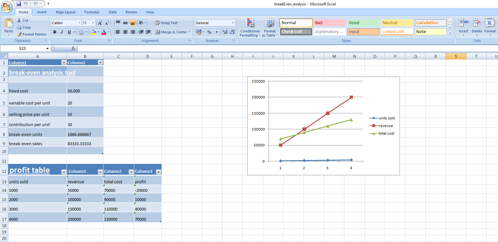

# break-even-analysis-tool
# 📊 Break-even Analysis Tool

 📌 Overview

This project is a financial model built using Microsoft Excel to calculate the break-even point and analyze profitability. It helps in understanding the relationship between cost, revenue, and profit using Cost-Volume-Profit (CVP) analysis.

## 🎯 Objective

To determine the minimum number of units a business must sell to cover all its costs and avoid losses.

## 🧮 Key Concepts Used

* Break-even Analysis
* Cost-Volume-Profit (CVP) Analysis
* Contribution Margin

## ⚙️ Features

* Calculates contribution per unit
* Computes break-even units and sales value
* Shows profit at different levels of output
* Includes a graphical representation (line chart) of cost and revenue

## 🛠️ Tools Used

* Microsoft Excel

## 📸 Dashboard Preview

 📈 How It Works

1. Enter Fixed Cost, Variable Cost per Unit, and Selling Price
2. The model calculates contribution per unit
3. Break-even point is automatically computed
4. Profit is calculated for different sales levels
5. A chart visually shows the break-even point where total cost equals total revenue

 📊 Output

* Break-even Units
* Break-even Sales
* Profit/Loss at different production levels
* Visual chart for analysis

## 🚀 Learning Outcome

This project demonstrates practical application of management accounting concepts and helps in making informed business decisions.

## 👤 Author
**Bhuvan Sharma**
US CMA Candidate

